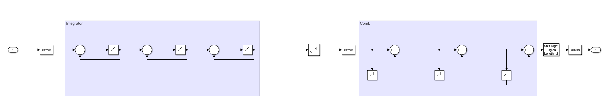
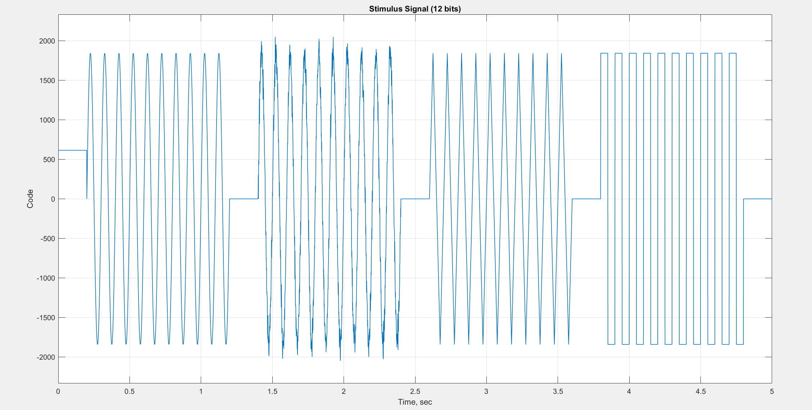
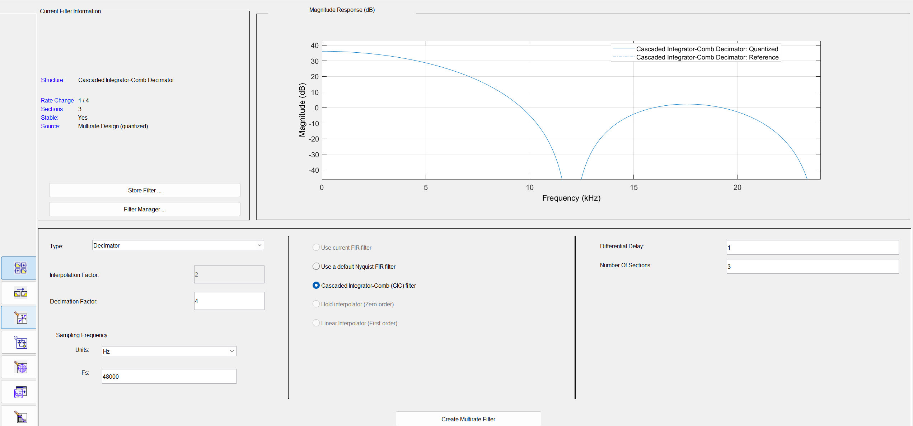
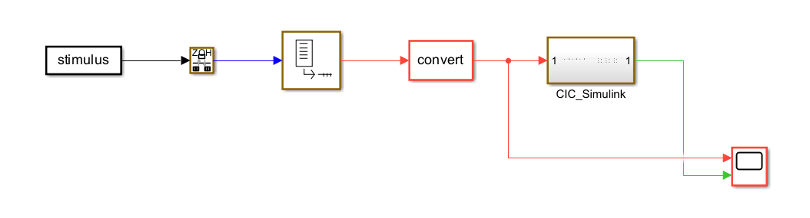
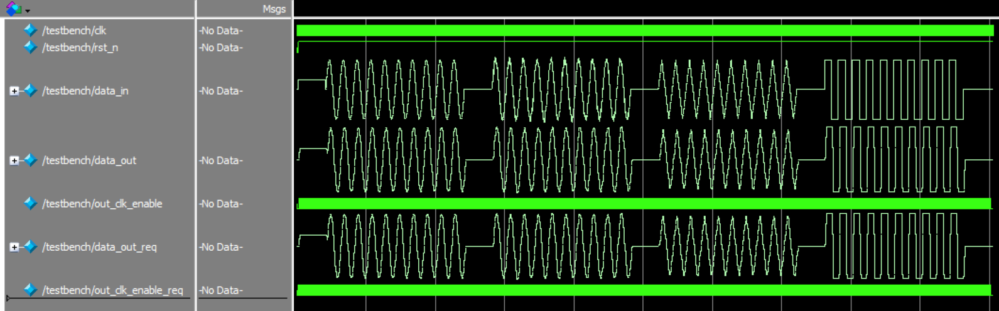
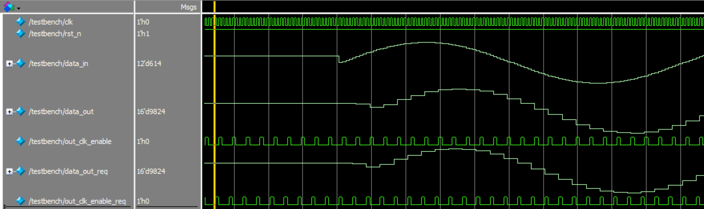
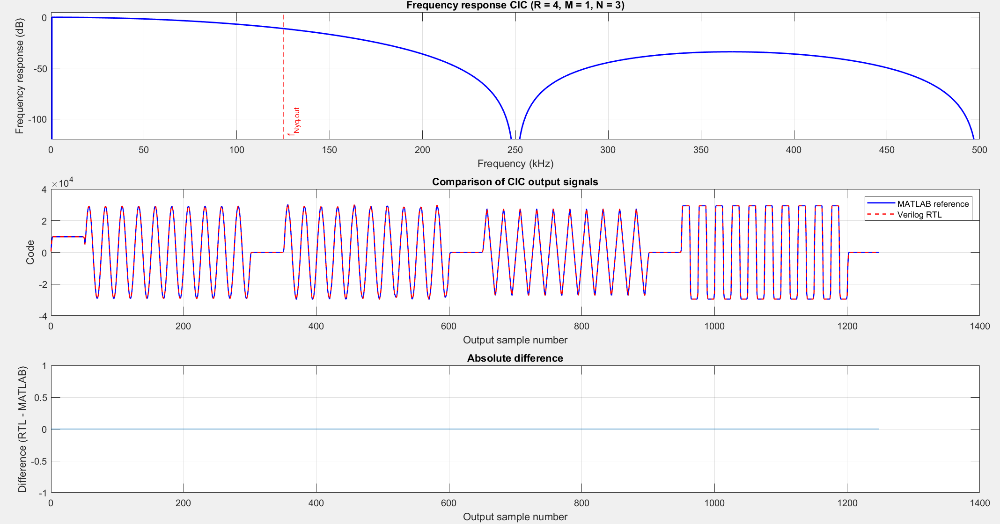

# CIC Decimation Filter
A fully parameterizable Cascaded Integrator-Comb (CIC) decimation filter implemented in Verilog with verification using SystemVerilog Testbench, MATLAB scripts, MATLAB Filter Designer, and a Simulink reference model.

Clone the Repo:
```
git clone https://github.com/pletnevAE/CIC_decimator.git
```

## Overview
The CIC decimation filter reduces the sampling frequency of a digital signal by an integer factor `R`.

Typical applications:
+ Decimation and filtering of high-speed data streams at the output of ΣΔ ADCs;
+ SDR;
+ Digital downconverters;
+ Radar and sonar.

## Theory Background
The CIC filter was proposed by Eugene Hogenauer in 1981 as a hardware-efficient structure for sampling rate conversion. Its Z-domain transfer function is:

$$H(z) = \frac{(1 - z^{-R \cdot M})^N}{1 - z^{-1}}$$

$R$ — decimation ratio, $M$ — differential delay of each comb stage, $N$ — filter order.

This is equivalent to $N$ cascaded moving averages of a rectangular window of length $R \cdot M$. The frequency response has zeros at multiples of $f_{\text{out}} = f_{\text{clk}}/R$.
The maximum DC frequency response is $(R \cdot M)^N$. The internal accumulators must be wide enough to represent this value without overflow – therefore:

```math
\text{ACC\_WIDTH} = \text{IN\_WIDTH} + N \cdot \log_2(R \cdot M)
```

## Architecture
The integrator section operates at the input clock frequency. The comb section is clocked by the `dec_pulse` signal and operates at a reduced frequency, $f_{clk}/R$. Key implementation features:
+ Only adders are used, without multipliers;
+ All internal bit widths are automatically determined by the specified parameters (without pruning);
+ The clk_enable signal enables operation in burst mode or with a controlled clock signal;
+ Asynchronous Active-Low reset (`rst_n`) is used.



## Interface
### Parameters:
| Parameter | Default Value | Description |
|:--:|:--:|:--:|
| `IN_WIDTH` | 12 | The input signal bit depth must be $\ge$ 2 |
| `OUT_WIDTH` | 16 | Output signal bit depth |
| `N` | 3 | Filter order – number of integrators/combs |
| `R` | 4 | Decimation ratio |
| `M` | 1 | Differential delay of each comb stage, usually 1 or 2 |

### Signals:
| Port | Direction | Width | Description |
|:--:|:--:|:--:|:--:|
| `clk` | Input | 1 | Clock Signal |
| `rst_n` | Input | 1 | Asynchronous Active-Low Reset |
| `clk_enable` | Input | 1 | Input strobe signal |
| `data_in` | Input | `IN_WIDTH` | Input signed data |
| `out_clk_enable` | Output | 1 | Output strobe signal |
| `data_out` | Output | `OUT_WIDTH` | Output signed data |

## Utilization
The project was synthesized for the 10M50DAF484C6GES FPGA on the DE10-Lite board using Quartus 22.1 Standard Edition.

For `IN_WIDTH = 12`, `OUT_WIDTH = 16`, `N = 3`, `R = 4`, `M = 1`, without additional optimization modes, the following results were obtained:
| FPGA | LUT | FF | Fmax, MHz | Hold Slack, ns | Setup Slack, ns |
|:--:|:--:|:--:|:--:|:--:|:--:|
| 10M50DAF484C6GES | 131 | 128 | 147.78 | 0.325 | 13.233 |

## Simulation
Before simulation, a fixed-point stimulus signal with a specified bit depth (the `bits` variable) and sign (the `is_signed` variable) is generated using the **stimulus.m** MATLAB script. The path to the file where the signal samples will be written is defined by the `OutFile` variable. The stimulus consists of 9 segments:
+ 5 segments holding a constant value for a specified number of samples;
+ a sine wave segment of specified amplitude and duration;
+ a noisy sine wave segment;
+ a triangle wave segment;
+ a pulse segment with a specified duty cycle.



Next, a Simulink model of the decimating CIC filter is formed using MATLAB Filter Designer (file **CIC_decimator.fda**), where the main parameters of the filter are set.


To test the model's operation, the **CIC_Test.slx** file is used, where the stimulus value vector from the stimulus signal generation script is fed to the filter input.

To further compare the reference model with the implemented CIC filter, a Simulink model is generated using the Simulink HDL Coder tool (file **CIC_HDL_Coder.slx**). The filter output must be right-shifted to the required number of bits.

The SystemVerilog testbench reads the stimulus signal from a file and writes the output samples of the reference model and the implemented CIC filter to the **output_matlab.txt** and **output_rtl.txt** files, respectively (file paths can be changed).



For the final comparison, the MATLAB script **compare_simulink_rtl.m** is used, which reads the output filter readings from the files obtained in the testbench, determines the absolute value of the deviation, and displays a graph of the filter's frequency response based on the parameters, a graph of the comparison of two signals with each other, and a graph of the absolute deviation.
